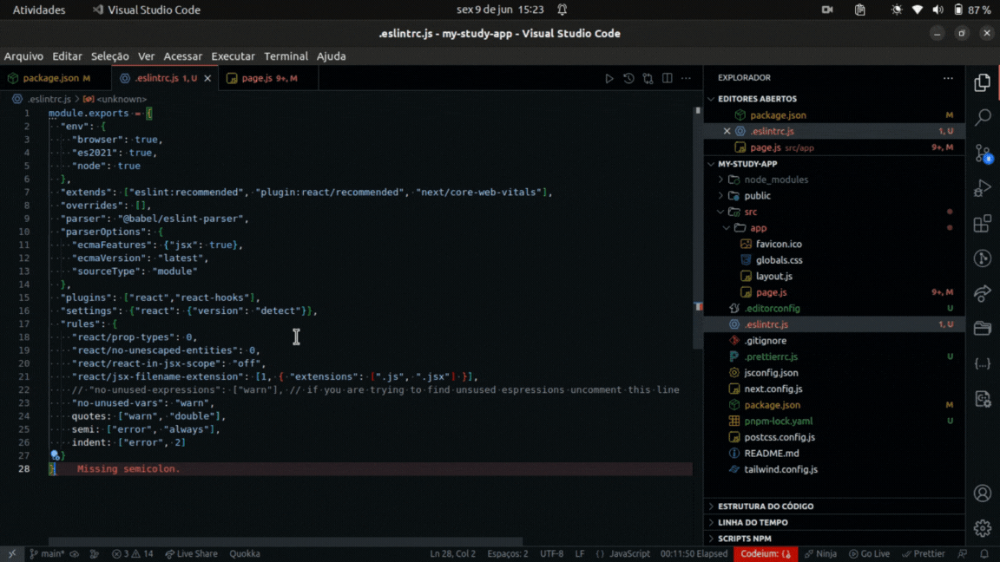
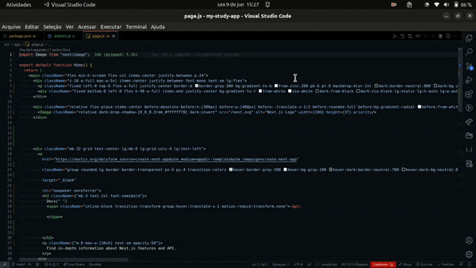
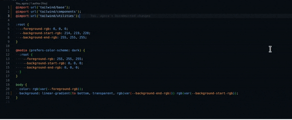
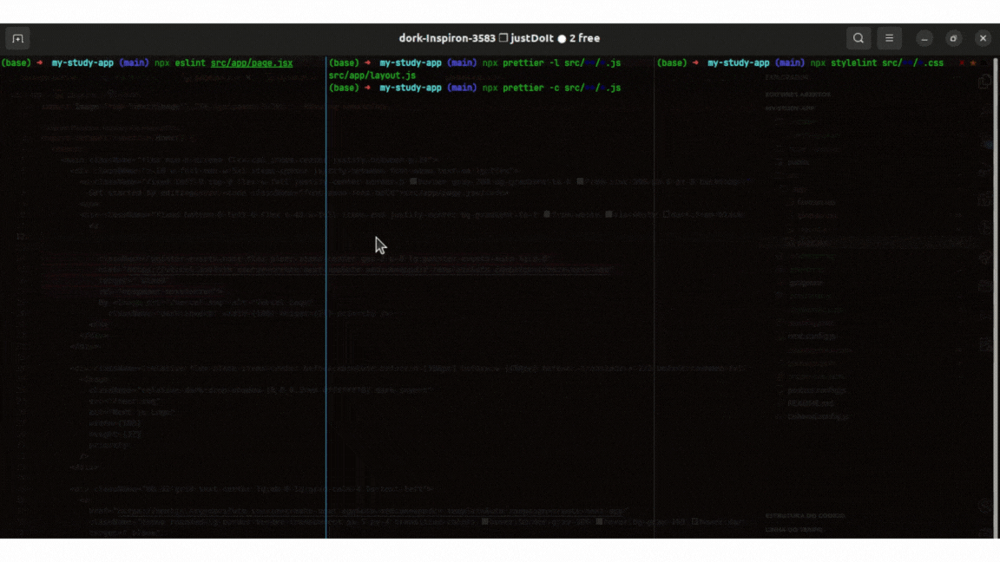

# Eslint, stylelint and Prettier config files
Just to make things easy

## Overview :owl:
Here will be most common config files.

Includes:

- `eslint`
  - `babel-eslint`
  - `eslint-plugin-react`
  - `eslint-plugin-react-hooks`

- `editorconfig`
- `stylelint`
- `prettier`

## Usage 🏖️

simply clone the repo and finally have fun.

```sh 
git clone https://github.com/calgns/format-config
cd ./format-config
```

basically move the files into _YourDir_ and delete this directory.
_OBS: change YourDir so you actually put a dir that you are working on and not the exemple one._
```sh 
mv .prettierrc.js .eslintrc.js .editorconfig .stylelintrc.json ../?YourDir?
rm -fr ../format-config
```

now in your dir run
```sh
# if you have pnpm good
pnpm i eslint@latest prettier@latest stylelint@latest -D

# if don't, you should, cause it's like npm but with some goods
npm i eslint@latest prettier@latest stylelint@latest -D

```


## How it should look and do
### first exemple simple one in js file

### second exemple more complex one in large jsx file

### third exemple simple one in css file


## commands on terminal
if in your settings you have chosen to format on save and if have errolens installed you will rarely see the terminal.

inside the root of the project

### eslint
```sh
# you have to specify if it's a js or jsx file
npx eslint src/**/*.jsx
```

### prettier
```sh
# this will normally output what it should be written
npx prettier src/app/layout.js 

# check the file so you can see if it's pretty 
npx prettier -c src/app/layout.js 

# check all the files
npx prettier -c src/**/*.jsx 

# formats the file
npx prettier -w src/app/layout.js 

# manual so you can do lots of things
npx prettier -h
```

### stylelint
```sh
# checks all css files and has a nice output
npx stylelint src/**/*.css
```

## How it should look on terminal
### running commands


## Don't forget
if you want it to work correctly then you should download each one extension in vscode and always explore the docs.

#### [eslint](https://eslint.org/) [stylelint](https://stylelint.io/) [prettier](https://prettier.io/) [editorconfig](https://editorconfig.org/) 

